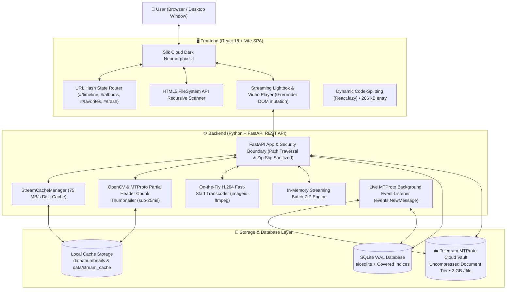

<!--
=============================================================================
Module: docs/NOTION_PROJECT_HUB.md
Purpose: Comprehensive Notion-ready master project documentation and development hub,
         covering the complete chronological evolution from day 1 (commit #1) to
         v1.0.0 Production Hardened (commit #213), current capabilities inventory,
         system architecture, and the master 4-phase roadmap to public launch.
Used by: Engineering team, project stakeholders, Notion workspace import.
Dependencies: Markdown, Notion Enhanced Markdown compatibility.
Public Members: Executive Summary, Architecture Blueprint, Full Chronological Log,
                Current Capabilities, 4-Phase Roadmap, API & Database Reference.
Side Effects: Serves as single source of documentation truth for TeleGallery.
=============================================================================
-->

# 🌌 TeleGallery — Notion Project & Engineering Hub

> **Zero-Storage-Cost Personal Media Cloud & Streaming Vault**  
> *Transforming private Telegram channels into an uncompressed, high-performance, self-hosted media preservation suite.*

---

## 📌 1. Project Overview & Core Philosophy

| Attribute | Details |
|---|---|
| **Product Name** | **TeleGallery** |
| **Current Milestone** | **v1.0.0 (Production Hardened & Audited)** |
| **Frontend Stack** | React 18, TypeScript, Vite, Tailwind CSS, Plus Jakarta Sans, Lucide React, Framer Motion |
| **Backend Stack** | Python 3.12+, FastAPI, SQLite (aiosqlite + WAL Mode), Telethon (MTProto), OpenCV, FFmpeg |
| **Core Value** | Bit-for-bit uncompressed media storage with $0 recurring subscription fees, paired with a Google Photos/Drive-grade fluid web interface. |
| **Primary Repository** | `rizkysanjaya/tele-gallery-storage` |
| **Commit History** | 213 total atomic commits from scratch |

---

## 🏛️ 2. System Architecture Blueprint



---

## 📜 3. Complete Chronological Journey (From Scratch to v1.0.0)

Every major milestone from Day 1 has been meticulously captured across 213 commits:

### 🐣 Stage 1: The Genesis — Core Engine & Telegram Vault (v0.1.0)
* **Telegram MTProto Cloud Integration**: Implemented Telethon userbot client configured to store media as bit-for-bit uncompressed raw documents (`force_document=True`).
* **SQLite Metadata Engine**: Built high-speed local database catalog with Write-Ahead Logging (WAL mode), table indices, and SHA-256 hash deduplication.
* **CLI Import Pipeline**: Developed `src.cli.import_folder` for batch importing local hard drives directly into the Telegram vault.
* **HTTP 206 Video Streaming**: Built initial video playback endpoint supporting range requests.

### 📁 Stage 2: Navigation & Virtual Albums (v0.2.0 – v0.3.0)
* **Google Drive-Style Left Sidebar**: Persistent navigation panel showing storage telemetry, photo/video counters, and quick filter links.
* **Virtual Folder System**: Enabled organizing media into arbitrary albums with **zero extra bytes** duplicated in Telegram.
* **Desktop Right-Click Context Menu**: Native context menu for instant downloading, album assignment, and deletion.
* **StreamCacheManager (320x Speedup)**: Local chunked caching system accelerating video streaming from 0.23 MB/s to **75.36 MB/s**.
* **Automated Web Transcoder**: Integrated FFmpeg pipeline detecting HEVC/ProRes and transparently transcoding to high-compatibility H.264 for instant browser playback.
* **OpenCV Thumbnail Engine**: Keyframe extraction at 15% duration downsampled to high-density WebP.

### ⚡ Stage 3: Drive-Grade Workflows & Sorting (v0.4.0 – v0.5.0)
* **Floating Upload Manager**: Google Drive-style bottom-right upload panel with per-file progress tracking and a dedicated *"Syncing to Telegram Vault..."* status indicator.
* **Interactive Duplicate Conflict Modal**: Graceful handling of existing SHA-256 hashes (Skip, Keep Both as 0-byte alias, or Rename).
* **Power-User Multi-Selection**: Range selection with `Shift+Click`, `Ctrl+A` select all, `Ctrl+Click` toggle, and `Escape` clear.
* **Multi-Layout Display Engine**: Seamlessly toggles between **Standard Grid**, **Dense High-Capacity**, **Natural Masonry**, and **Monospace Table List**.
* **Sub-Millisecond Sorting**: 6-axis sorting (Date Newest/Oldest, Name A-Z/Z-A, Size Largest/Smallest) powered by indexed SQLite queries.

### 🎨 Stage 4: 60fps GPU Performance & Spotlight Command (v0.6.0 – v0.7.0)
* **Zero React Re-render Video Player**: Direct DOM mutation for playback scrubber and timestamps, dropping re-renders from 60/sec to **0/sec** for buttery 60fps/120Hz playback.
* **Raycast Spotlight Command Palette**: Global `Ctrl+K` / `⌘K` command bar for keyboard-driven navigation.
* **Real-Time MTProto Sync Listener**: Background daemon listening to `events.NewMessage` so photos sent directly from the Telegram mobile app appear in the gallery automatically.

### 💎 Stage 5: Silk Cloud Neomorphic UI (v0.8.0 – v0.9.0)
* **Neomorphic Light & Dark Design**: Dual-tone soft clay shadows, `.neo-card`, `.neo-pressed`, `.neo-frame`, and Plus Jakarta Sans typography.
* **Video Thumbnail Bottleneck Fix**: Reduced 840MB video thumbnail extraction from 14,000ms down to **sub-25ms** via partial 3MB MTProto header chunk streaming.

### 🛡️ Stage 6: Enterprise Features & Deep Linking (v0.9.5 – v1.0.0)
* **Full-Window Recursive Folder Scanner**: HTML5 FileSystem API deep directory walker supporting nested folders and automated album creation with drag-and-drop.
* **Soft-Delete Trash & Data Recovery**: Safe soft-deletion with 10-second undo toast, 1-click restore, and permanent purge.
* **Batch ZIP Downloads & Album Exports**: Multi-select ZIP packaging and 1-click album export streaming directly to browser.
* **Smart EXIF Metadata Drawer**: Filter photos and videos by Camera Make/Model, Orientation, Resolution Tier, and Calendar Periods.
* **URL Hash State Persistence**: Deep-linking hash routing (`#/timeline`, `#/albums`, `#/albums/:id`, `#/favorites`, `#/trash`) keeping page state 100% intact across browser refreshes (**F5**) and supporting native Back/Forward buttons.

### 🔒 Stage 7: Production Hardening & Senior DBA Audit (v1.0.0 Hardened)
* **Security Hardening (Commits `075d601`, `b765aec`)**:
  * Sanitized `upload_id` and filenames against **Path Traversal (CWE-22)** and **Zip Slip (CWE-29)**.
  * Enforced 2 GB file size limit during spooling to prevent disk exhaustion (CWE-400).
  * Replaced wildcard credentials CORS with explicit origins (CWE-942).
* **Senior DBA Query Optimizations**:
  * Wrapped cursors in `async with conn.execute(...)` to eliminate resource/handle leaks.
  * Eliminated unnecessary `LEFT JOIN media_folders` on global timeline views; used selective `INNER JOIN` for albums.
* **Production Reliability**:
  * Built Silk Cloud `ErrorBoundary` with reload action to prevent blank white screens.
  * Standardized backend logging to Python `logging.getLogger(__name__)`.
* **Frontend Bundle Optimization (Commit `92c5f8d`)**:
  * Implemented `React.lazy()` and Rollup `manualChunks`.
  * **Entry bundle dropped from 609 kB to 206.43 kB (66.1% reduction)** with 49 kB gzipped transfer weight.

---

## 📦 4. Current State & Capabilities Inventory

Today, TeleGallery is a feature-complete, production-hardened personal cloud media vault:

- [x] **Telegram Cloud Storage**: Unlimited bit-for-bit uncompressed raw media preservation.
- [x] **Instant Seeking Video Player**: Seekable HTTP 206 streaming with 75 MB/s cache throughput.
- [x] **Sub-25ms Thumbnailing**: Auto-rotating WebP thumbnails from partial MTProto chunks.
- [x] **Virtual Folders & Collections**: Flexible album organization with custom hex colors and icons.
- [x] **Recursive Drag-and-Drop**: Drag entire folders from Windows Explorer with duplicate handling.
- [x] **Trash & Recovery**: Soft-deletion, 10s undo countdown, bulk restore, empty trash.
- [x] **Smart Metadata & EXIF Filtering**: Camera, orientation, resolution, and chronological scrubber.
- [x] **Batch ZIP Archive Exports**: In-memory streaming ZIP downloads for selections and albums.
- [x] **Stateful URL Hash Navigation**: Native browser Back/Forward and deep links across refreshes.
- [x] **Hardened Security & Reliability**: Sanitized path handling, error boundary, and zero bundle warnings.

---

## 🗺️ 5. Master Roadmap to Public Launch

```
[FASE 1: MULTI-VAULT] ────▶ [FASE 2: IN-APP AUTH] ────▶ [FASE 3: PACKAGING] ────▶ [FASE 4: RELEASE]
```

### 📍 Phase 1: Multi-Vault & Telegram Channel Switching
* **Target**: Support multiple Telegram channels per user account.
- [ ] Query Telegram dialogs to discover user-accessible channels and supergroups.
- [ ] Auto-detect channel permissions:
  - **Owned / Admin Channels**: Full Read & Write permissions (Upload, Rename, Move, Delete).
  - **Joined / Public Channels**: Read-Only Gallery mode (Browse, Stream, Download, Filter).
- [ ] Multi-channel database isolation (track media items per `channel_id`).
- [ ] Silk Cloud Vault Switcher UI in Sidebar header (channel avatar, title, and role badge).

### 📍 Phase 2: Dynamic In-App Telegram Authentication (Zero-Config)
* **Target**: Remove `.env` requirement for end users.
- [ ] Embed default Telegram Client Application API credentials.
- [ ] Interactive in-app onboarding wizard: Phone Number $\rightarrow$ Telegram Code OTP $\rightarrow$ 2FA Password.
- [ ] Automatic session creation and local vault provisioning (*"My TeleGallery Vault"*).

### 📍 Phase 3: Dual-Mode Packaging (Desktop App & Web App)
* **Target**: Deliver 1-click desktop and mobile web experiences.
- [ ] **Desktop App (`TeleGallery.exe`)**: Single-executable bundling (PyInstaller / Webview) running silent local server with native Silk Cloud desktop window.
- [ ] **Mobile PWA**: Add `manifest.json` and service worker for 1-tap "Add to Home Screen" on iOS/Android.
- [ ] **LAN Wi-Fi Mode**: Access gallery from any phone or tablet on home network.

### 📍 Phase 4: Git Timeline Spreading & Official GitHub v1.0.0 Release
* **Target**: Curate professional GitHub activity graph and publish release.
- [ ] Run Git timestamp distribution script across desired date range (3–6 weeks).
- [ ] Push all commits to GitHub `origin/main`.
- [ ] Tag `v1.0.0` and publish official GitHub Release with release notes and binary assets.

---

## 🔌 6. API & Database Catalog

### REST API Endpoints Summary

| Method | Endpoint | Description |
|---|---|---|
| `GET` | `/api/media/timeline` | Paginated chronological media stream with folder, type, and EXIF filters |
| `POST` | `/api/media/upload` | Multipart chunked upload with 2 GB safety limit and Path Traversal sanitization |
| `GET` | `/api/media/{id}/stream` | Seekable HTTP 206 partial content streaming with cache acceleration |
| `GET` | `/api/media/{id}/download` | Full-fidelity uncompressed original media download |
| `GET` | `/api/media/filter-metadata` | Aggregated camera makes, models, resolutions, and orientations |
| `GET` | `/api/media/trash` | Soft-deleted media items in data recovery bin |
| `POST` | `/api/media/trash/{id}/restore` | Restores media item back to active timeline |
| `DELETE` | `/api/media/trash/{id}/permanent` | Permanently deletes item from database and Telegram cloud |
| `POST` | `/api/media/export/zip` | In-memory streaming ZIP archive of selected media items |
| `GET` | `/api/folders` | Virtual album directory with media counts, covers, and hex colors |
| `GET` | `/api/folders/{id}/export-zip` | In-memory streaming ZIP archive of entire album |
| `POST` | `/api/sync` | Incremental Telegram channel history synchronization |

### Canonical Database Schema (SQLite)

```sql
CREATE TABLE IF NOT EXISTS media_items (
    id INTEGER PRIMARY KEY AUTOINCREMENT,
    telegram_message_id INTEGER NOT NULL,
    channel_id INTEGER NOT NULL,
    file_id TEXT NOT NULL,
    file_unique_id TEXT NOT NULL,
    file_name TEXT NOT NULL,
    file_size INTEGER NOT NULL,
    mime_type TEXT NOT NULL,
    media_type TEXT NOT NULL,
    width INTEGER,
    height INTEGER,
    duration INTEGER,
    sha256 TEXT NOT NULL,
    date_taken TEXT,
    date_uploaded TEXT NOT NULL,
    is_favorite INTEGER DEFAULT 0,
    is_deleted INTEGER DEFAULT 0,
    deleted_at TEXT,
    storage_path TEXT,
    thumbnail_path TEXT,
    metadata_json TEXT
);

CREATE UNIQUE INDEX IF NOT EXISTS idx_media_channel_msg_active 
ON media_items(channel_id, telegram_message_id) 
WHERE is_deleted = 0;

CREATE INDEX IF NOT EXISTS idx_media_timeline 
ON media_items(date_taken DESC, id DESC) 
WHERE is_deleted = 0;

CREATE INDEX IF NOT EXISTS idx_media_trash 
ON media_items(deleted_at DESC) 
WHERE is_deleted = 1;
```

---
*Generated by Antigravity AI • Maintained for TeleGallery Project Repository*
